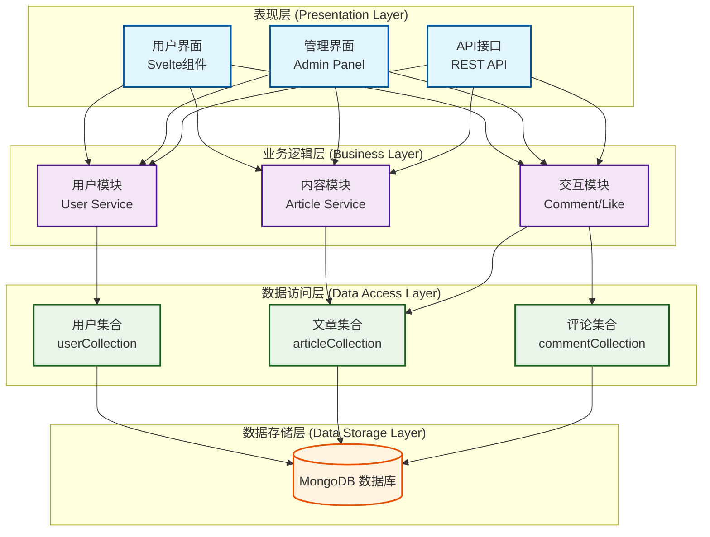

# 架构设计报告

## 1. 项目概述

### 1.1 项目简介
Synapse 是一个专注于文本交流的Web应用平台，致力于提供深度文本交流体验。项目基于现代Web技术栈，采用前后端一体化的全栈开发模式，实现了完整的内容创作、分享和交流功能。

### 1.2 技术栈选择
- **前端框架**: SvelteKit(支持SSR和SPA模式)
- **后端语言**: TypeScript/JavaScript (Node.js)
- **数据库**: MongoDB(支持本地和云端部署)
- **样式**: CSS
- **构建工具**: Vite(SvelteKit内置)
- **测试框架**: Vitest
- **文档生成**: TypeDoc
- **版本控制**: Git
- **邮件服务**: 第三方邮件发送功能

### 1.3 开发历程概览
- **初期阶段**: 基础架构搭建、用户认证系统
- **功能扩展阶段**: 文章系统、评论系统、搜索功能
- **管理系统阶段**: 后台管理、用户管理、内容管理
- **优化完善阶段**: UI/UX优化、测试补充、文档完善
- **当前状态**: 56个Pull Request，活跃的团队协作开发

## 2. 系统整体架构

### 2.1 架构模式
系统采用**分层架构**结合**全栈同构**的设计模式：



### 2.2 核心架构组件

#### 2.2.1 SvelteKit 全栈框架
- **统一路由系统**: 基于文件系统的路由，包含32个服务端路由文件和21个Svelte组件
- **服务端渲染 (SSR)**: 提供更好的SEO和初始加载性能
- **客户端水合**: 平滑的用户交互体验
- **API路由**: 内置API端点，无需单独的后端服务器

#### 2.2.2 模块化组件系统
```
src/lib/components/
├── ArticleCard.svelte      # 文章卡片组件
├── ArticleForm.svelte      # 文章编辑表单
├── CommentForm.svelte      # 评论表单组件
├── CommentList.svelte      # 评论列表组件
├── Modal.svelte           # 通用模态框组件
└── SearchResult.svelte    # 搜索结果组件
```

#### 2.2.3 状态管理架构
- **服务端状态**: 通过SvelteKit的load函数管理
- **客户端状态**: 使用Svelte stores进行响应式状态管理
- **会话管理**: 会话管理系统，集成数据库持久化

## 3. 关键设计决策

### 3.1 技术选型决策

#### 3.1.1 SvelteKit vs 其他框架
**选择理由**:
- **性能优势**: 编译时优化，运行时体积小
- **开发体验**: 简洁的语法，较少的样板代码
- **全栈能力**: 内置SSR和API路由
- **类型安全**: 完整的TypeScript支持

#### 3.1.2 MongoDB vs 关系型数据库
**选择理由**:
- **文档模型**: 适合内容管理系统的非结构化数据
- **快速开发**: 无需复杂的ORM映射
- **可扩展性**: 水平扩展能力强
- **JSON兼容**: 与JavaScript生态系统无缝集成

### 3.2 架构设计决策

#### 3.2.1 单体应用 vs 微服务
**决策**: 选择单体应用架构
**理由**:
- 团队规模适中，降低运维复杂度
- 快速迭代开发，减少服务间通信成本
- 数据一致性保证更简单
- 部署和监控统一管理

#### 3.2.2 数据库设计模式
**决策**: 采用集合分离的文档数据库设计
```typescript
// 核心数据集合
- users: 用户信息
- articles: 文章内容
- comments: 评论数据
- sessions: 会话管理
- admins: 管理员权限
- messages: 系统消息
- verifyCode: 验证码管理
```

### 3.3 安全架构决策

#### 3.3.1 认证与授权
- **会话认证**: 基于服务端会话的认证机制
- **密码加密**: 使用bcryptjs进行密码哈希
- **权限分离**: 用户/管理员分级权限控制
- **CSRF保护**: SvelteKit内置CSRF防护

#### 3.3.2 数据验证
- **服务端验证**: 所有API端点进行严格的数据验证
- **类型安全**: TypeScript提供编译时类型检查
- **输入消毒**: 防止XSS攻击的输入处理

## 4. 系统模块设计

### 4.1 数据访问层架构

#### 4.1.1 数据库连接管理
```typescript
// 单例模式的数据库连接
export async function connectToDatabase(): Promise<Db> {
    if (dbInstance) {
        return dbInstance;
    }
    // 连接逻辑...
}
```

#### 4.1.2 集合操作抽象
每个数据集合都有独立的操作模块：
- `userCollection.ts`: 用户CRUD操作
- `articleCollection.ts`: 文章管理操作
- `commentCollection.ts`: 评论系统操作
- `sessionCollection.ts`: 会话管理操作
- `adminCollection.ts`: 管理员操作
- `messageCollection.ts`: 消息系统操作

### 4.2 业务逻辑层架构

#### 4.2.1 用户模块
- 用户注册/登录逻辑
- 密码加密验证
- 会话管理
- 用户资料管理

#### 4.2.2 内容模块
- 文章创建/编辑/删除
- 草稿保存功能
- 文章发布机制
- 内容搜索功能

#### 4.2.3 交互模块
- 评论系统
- 点赞/收藏功能
- 消息通知系统

### 4.3 API设计架构

#### 4.3.1 RESTful API设计
```
/api/articles          # 文章相关API
/api/comments          # 评论相关API
/api/users             # 用户相关API
/api/admin             # 管理员API
/api/search            # 搜索API
/api/verify-code       # 验证码API
```

#### 4.3.2 统一错误处理
- 标准化的错误响应格式
- 详细的错误日志记录
- 用户友好的错误消息

### 4.4 前端架构设计

#### 4.4.1 路由结构
```
routes/
├── +layout.svelte              # 全局布局
├── +page.svelte               # 首页
├── admin/                     # 管理后台
├── articles/                  # 文章相关页面
├── login/                     # 登录页面
├── register/                  # 注册页面
├── my/                        # 用户个人中心
└── search/                    # 搜索页面
```

#### 4.4.2 组件设计原则
- **可复用性**: 通用组件抽取
- **单一职责**: 每个组件专注特定功能
- **Props传递**: 明确的组件间数据流
- **事件处理**: 统一的事件管理模式

## 5. 性能与可扩展性设计

### 5.1 性能优化策略

#### 5.1.1 前端性能
- **代码分割**: Vite自动代码分割
- **懒加载**: 组件和路由懒加载
- **资源优化**: 静态资源压缩和缓存
- **SSR优化**: 服务端渲染减少首屏时间

#### 5.1.2 后端性能
- **数据库索引**: 关键字段建立索引
- **连接池**: MongoDB连接复用
- **查询优化**: 避免N+1查询问题
- **缓存策略**: 会话和常用数据缓存

### 5.2 可扩展性设计

#### 5.2.1 水平扩展能力
- **无状态设计**: API端点无状态设计
- **数据库分片**: MongoDB支持分片扩展
- **负载均衡**: 支持多实例部署

#### 5.2.2 功能扩展性
- **插件化架构**: 新功能模块化添加
- **API版本控制**: 向后兼容的API设计
- **配置管理**: 环境变量配置分离

## 6. 安全架构

### 6.1 身份验证架构
```typescript
// 中间件认证流程
export const handle: Handle = async ({ event, resolve }) => {
    const sessionId = event.cookies.get('sessionId');
    // 会话验证逻辑
    // 用户信息注入event.locals
};
```

### 6.2 权限控制系统
- **角色分离**: 普通用户/管理员角色/超级管理员角色
- **页面级权限**: 路由级别的权限检查
- **API级权限**: 接口级别的权限验证
- **数据级权限**: 用户只能操作自己的数据

### 6.3 数据安全措施
- **输入验证**: 严格的输入参数验证
- **SQL注入防护**: 使用参数化查询
- **XSS防护**: 输出转义和CSP策略
- **密码安全**: bcrypt加密存储

## 7. 测试架构

### 7.1 测试策略
- **单元测试**: 数据库操作层测试 (Vitest)
- **集成测试**: API端点测试
- **端到端测试**: 用户流程测试

### 7.2 测试覆盖范围
- 数据库连接和操作测试
- 用户认证流程测试
- 核心业务逻辑测试
- API接口功能测试

## 8. 部署架构

### 8.1 构建流程
```json
{
  "scripts": {
    "dev": "vite dev",
    "build": "vite build", 
    "preview": "vite preview",
    "test": "vitest run"
  }
}
```

### 8.2 环境配置
- **开发环境**: 本地MongoDB + 热重载
- **测试环境**: 内存数据库测试
- **生产环境**: 云端MongoDB + 优化构建

## 9. 文档生成架构

### 9.1 自动化文档
- **TypeDoc**: 自动生成API文档
- **注释标准**: JSDoc规范注释
- **文档部署**: 静态文档网站生成

### 9.2 文档结构
```
docs/
├── index.html              # 文档首页
├── modules.html            # 模块列表
├── hierarchy.html          # 类型层次
└── functions/              # API函数文档
```

## 10. 团队协作架构

### 10.1 版本控制策略
- **Git工作流**: 分支开发模式
- **代码审查**: Pull Request机制
- **持续集成**: 自动化构建

### 10.2 开发规范
- **TypeScript严格模式**: 类型安全保证
- **提交规范**: 规范化提交信息

## 11. 未来架构演进方向

### 11.1 技术演进
- **实时功能**: WebSocket支持实时通知
- **PWA改造**: 离线功能和移动端优化
- **微前端**: 大型应用的模块化拆分

### 11.2 功能扩展
- **推荐系统**: 个性化内容推荐
- **全文搜索**: Elasticsearch集成
- **CDN集成**: 静态资源加速
- **国际化**: 多语言支持

### 11.3 运维演进
- **容器化**: Docker部署支持
- **CI/CD管道**: 自动化部署流程
- **监控系统**: APM和日志聚合
- **备份策略**: 数据备份和灾难恢复

## 12. 总结

Synapse项目采用现代化的全栈架构设计，通过SvelteKit + MongoDB的技术组合，实现了一个功能完善、架构清晰、易于维护和扩展的文本交流平台。

### 12.1 架构优势
1. **全栈一体化**: 减少技术栈复杂度，提高开发效率
2. **类型安全**: TypeScript提供完整的类型保护
3. **模块化设计**: 清晰的分层架构，便于维护和扩展
4. **性能优化**: SSR和现代构建工具保证性能
5. **安全可靠**: 多层次的安全防护机制

### 12.2 设计亮点
- 单例模式的数据库连接管理
- 基于文件系统的路由架构
- 组件化的前端开发模式
- 完整的测试覆盖体系
- 自动化的文档生成系统

### 12.3 技术债务与改进空间
- 考虑引入更完善的缓存策略
- 优化数据库查询性能
- 增强错误处理和恢复机制
- 完善监控和告警系统
